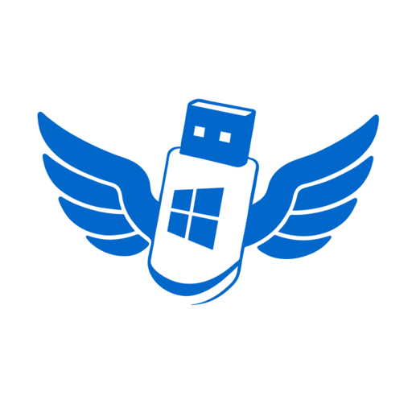
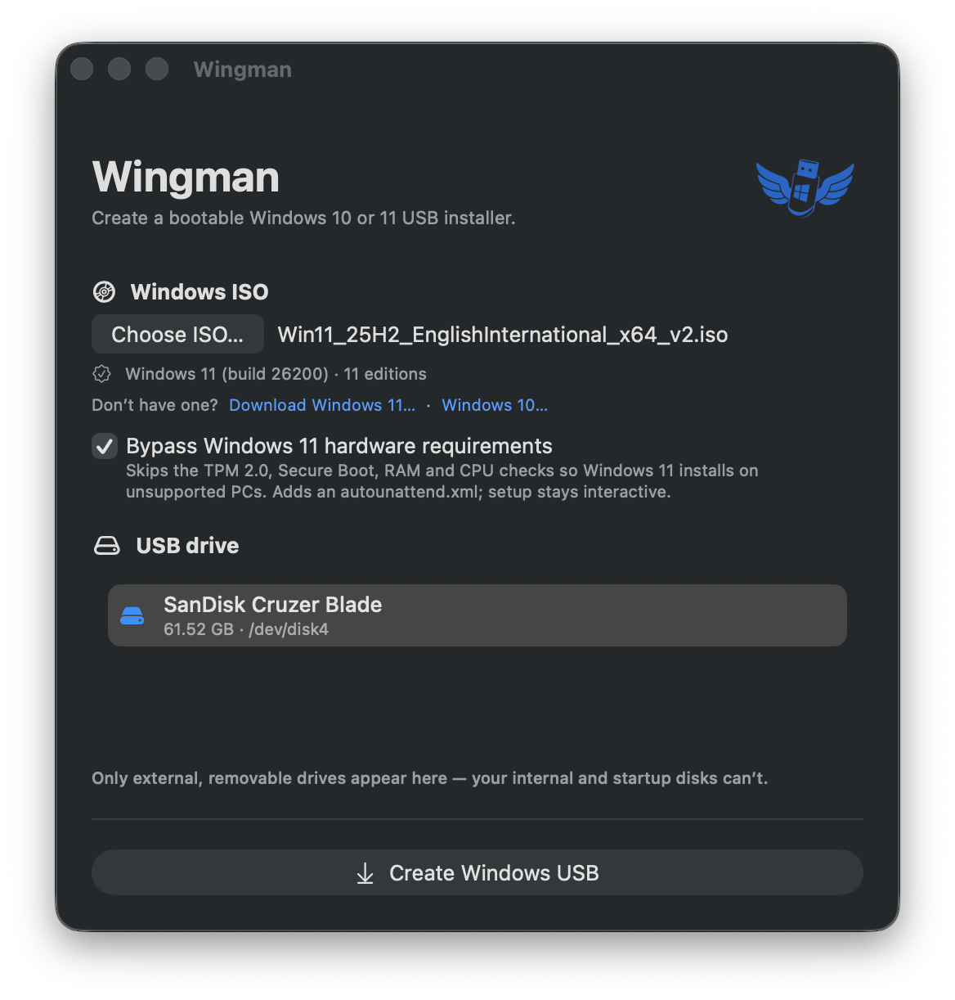

<p align="center">
  
</p>

<h1 align="center">Wingman</h1>

<p align="center">
  Create a bootable Windows 10 or 11 USB installer on macOS.
</p>

<p align="center">
  <a href="https://github.com/duggan/Wingman/actions/workflows/ci.yml"></a>
  <a href="LICENSE"></a>
</p>

<p align="center">
  
</p>

Wingman turns a Microsoft Windows 10 or 11 ISO into a bootable USB installer. It's a native SwiftUI app, properly **code-signed and notarized**, and the whole pipeline — format → copy → split `install.wim` — runs from a single click.

> ⚠️ **Creating an installer erases the entire selected USB drive.** Back up anything on it first. Wingman only lists external, removable drives and refuses your internal/startup disk — but you choose which stick to erase.

## Install

1. Download `Wingman.dmg` from the [latest release](https://github.com/duggan/Wingman/releases/latest).
2. Open it and drag **Wingman** to **Applications**.
3. Launch Wingman. On first run, approve it under **System Settings ▸ General ▸ Login Items & Extensions** so it can format USB drives — macOS requires this, and Wingman detects the approval automatically.

The app is notarized, so Gatekeeper opens it without a security override.

## Requirements

- **macOS 13 (Ventura) or later** — universal (Apple Silicon + Intel).
- A **USB stick** large enough for the installer (8 GB or more).
- **Your own Windows 10 or 11 ISO** — download from Microsoft ([Windows 11](https://www.microsoft.com/software-download/windows11) · [Windows 10](https://www.microsoft.com/software-download/windows10)). The ISO must contain `sources/install.wim`; consumer ISOs that ship a solid-compressed `install.esd` can't be split onto FAT32 (Wingman detects this and points you to the right ISO).
- The result **boots PCs, not Macs** — an Apple Silicon or Intel Mac cannot boot a Windows installer USB. Test it on the target PC.

## Using Wingman

1. **Choose ISO…** and pick your Windows ISO. Wingman identifies the release (Windows 10 or 11) and its editions.
2. *(Windows 11 only, optional)* tick **Bypass Windows 11 hardware requirements** to skip the TPM / Secure Boot / RAM / CPU checks — see [below](#bypassing-the-windows-11-hardware-checks-optional).
3. Select your **USB drive** from the list.
4. Click **Create Windows USB**, then confirm **Erase and Create**. Formatting, copying, and splitting `install.wim` run as one action, and Wingman ejects the stick when it's done.

## Why this exists

[WinDiskWriter][wdw] pioneered making bootable Windows USBs on macOS, and Wingman owes a lot to it. Where Wingman differs is **distribution**: WinDiskWriter's privileged step uses `AuthorizationExecuteWithPrivileges`, an API deprecated since macOS 10.7 that doesn't satisfy the Hardened Runtime — so the app can't be notarized. Wingman uses the modern `SMAppService` privileged-helper model (macOS 13+) instead, so it ships signed, notarized, and stapled, and launches without Gatekeeper warnings.

## How it works

Windows 10 and 11 ISOs are UDF and not "isohybrid", so `dd` is unreliable. UEFI firmware is only guaranteed to boot **FAT32**, but the ISO's `sources/install.wim` is several GB — over FAT32's 4 GB per-file limit. Wingman:

1. Erases the USB and formats a single **FAT32** partition (MBR).
2. Copies every ISO file **except** `sources/install.wim`.
3. **Splits** `install.wim` into ~3.8 GB `install.swm` parts (under FAT32's 4 GiB per-file limit); Windows Setup reassembles them automatically at install time.

UEFI boots it via the ISO's own `efi/boot/bootx64.efi` — no custom bootloader.

### Windows 10 and 11

Wingman reads the chosen ISO's `install.wim` XML (a few KB) to identify the release — **Windows 10 vs 11, and every edition** — and adapts the UI accordingly. Both are first-class targets.

### Bypassing the Windows 11 hardware checks (optional)

To install Windows 11 on hardware Microsoft deems "unsupported", an opt-in checkbox writes the same bypass the popular tools use — **as pure file drops, no image rewriting**:

- an **`autounattend.xml`** at the USB root that seeds the `HKLM\SYSTEM\Setup\LabConfig` bypass keys (`BypassTPMCheck`, `BypassSecureBootCheck`, `BypassRAMCheck`, …) during the `windowsPE` pass, before Setup's compatibility gate runs — and **nothing else**, so the install stays fully interactive (no unattended disk wipe);
- a blanked **`sources/appraiserres.dll`**, so the appraiser skips the checks even when the newer setup engine ignores the answer file.

The toggle is **off by default** and hidden for media confirmed to be Windows 10. WinDiskWriter achieves a similar result by setting `INSTALLATIONTYPE=Server` in the WIM; Wingman uses file drops instead, which avoids rewriting the image and matches what Rufus does on current builds.

> Installing Windows 11 on unsupported hardware is a configuration Microsoft does not officially support, and such PCs may not receive updates. Use it on hardware you own.

### A codec-free, pure-Swift WIM splitter

WIM splitting normally implies a dependency on `wimlib` (a large C library). It turns out you don't need it — or any compression codec. A retail `install.wim` stores its **blob table uncompressed**, and a split just **copies the already-compressed file blobs verbatim** into part files and rewrites the headers + per-part blob tables. So [`WimKit`](Sources/WimKit/) reimplements the split in pure Swift with **no LZX/XPRESS decoder and no external library**. `wimlib` is used only as a *development-time test oracle*; it is not shipped. This keeps the app a single, self-contained binary that rebuilds on future macOS with nothing but the Swift toolchain.

## Architecture

```
Wingman.app
├─ Contents/MacOS/Wingman          SwiftUI GUI + WimKit (unsandboxed, Developer ID)
├─ Contents/MacOS/WingmanHelper    root LaunchDaemon (bare Mach-O, Info.plist in __TEXT)
└─ Contents/Library/LaunchDaemons/
     ie.duggan.Wingman.Helper.plist  SMAppService daemon definition
```

The privilege boundary follows **least privilege**: the root daemon does *only* the one thing that needs root — partition/format the disk. Everything else (device enumeration, ISO mount, file copy, WIM split) runs unprivileged in the app, because reading an ISO and writing a permission-less FAT32 volume don't need root.

| Concern | Choice |
|---|---|
| Privilege escalation | `SMAppService` daemon + XPC (not `AuthorizationExecuteWithPrivileges`) |
| App ↔ daemon trust | narrow typed XPC API, validated both ways via `NSXPCConnection.setCodeSigningRequirement` (audit-token based) |
| Device picker | `DiskArbitration` — gated on `internal == false` **and** removable/ejectable, plus explicit boot-disk exclusion (walks APFS physical stores) |
| Partition/format | `diskutil` (the **only** root operation), with independent target re-validation in the daemon |
| ISO mount + copy | `hdiutil attach -plist` + streamed copy (app-side, unprivileged) |
| WIM split | pure-Swift [`WimKit`](Sources/WimKit/) — no codec, no external dependency |
| Version detection | reads the `install.wim`/`.esd` XML resource (UTF-16LE, uncompressed) for release + editions; build ≥ 22000 ⇒ Windows 11 |
| Win 11 bypass | opt-in `autounattend.xml` (windowsPE `LabConfig` keys) + blanked `appraiserres.dll`, app-side file drops only |
| Distribution | Developer ID + Hardened Runtime + notarized DMG (no App Store) |

## Build from source

For development only — to *use* Wingman, just download the DMG (see [Install](#install)).

Requires **Xcode 15.3+ (Swift 5.10)** and a **Developer ID Application** signing identity. `SMAppService` daemons must be code-signed to register, so an unsigned build won't work. A few targets also need Homebrew tools: `make dmg`/`make release` use `create-dmg`, and `make fetch-iso` uses `powershell`.

```sh
make sign     # build universal, assemble the .app, sign helper + app
make run      # sign, then launch
make dmg      # build a signed (un-notarized) DMG for local testing
make test     # run the WimKit unit tests (no ISO needed)
make help     # list all targets
```

If you fork this project, change the bundle IDs and Team ID (in `Sources/WingmanShared/Constants.swift` and the `Makefile`) to your own.

## Release (notarized DMG)

For maintainers cutting a signed release. One-time credential setup — `make notary-setup` prints the exact command with your own values:

```sh
xcrun notarytool store-credentials wingman \
    --apple-id you@example.com --team-id <YOUR_TEAM_ID> --password <app-specific-password>
```

Then:

```sh
make release   # signs, notarizes + staples the .app, builds + notarizes + staples the DMG
```

## Validation

- **Real boot:** a Wingman-made stick UEFI-boots a Dell into the Windows 11 Setup wizard, all 11 editions present.
- **Split integrity:** `wimlib-imagex verify` recomputes every blob's SHA-1 across the `.swm` set — passing both for a synthetic test WIM (with an identical extracted tree) and for a real 7.5 GB `install.wim`, read back off the FAT32 USB.
- **Safety:** the device gate was verified live to exclude the internal SSD and even removable-flagged disk-image mounts; the daemon re-validates any target (and refuses the boot disk) before erasing.

Tested against real Windows 11 25H2 and Windows 10 22H2 retail ISOs.

## Scope & limitations

- Targets retail Windows install media: non-bootable, non-solid WIMs with an uncompressed blob table. `WimKit` refuses solid resources and compressed blob tables with a clear error (rather than producing bad media), so consumer `install.esd` ISOs aren't supported.
- An Apple Silicon (or Intel) Mac **cannot** boot a Windows USB; test the result on a PC.

## Windows media & trademarks

You supply your own Windows ISO. Wingman does **not** distribute, bundle, or host any Microsoft software — it only links to Microsoft's official download pages and reads an ISO you already have. Your use of any Windows ISO is governed by Microsoft's license terms. "Windows" and "Microsoft" are trademarks of Microsoft Corporation; this project is independent and not affiliated with or endorsed by Microsoft.

## License

[GPL-3.0](LICENSE), provided "as is" without warranty. Wingman studies the behavior of [WinDiskWriter][wdw] (also GPL-3.0) but is an independent implementation; its WIM splitter is original pure Swift, with `wimlib` used only as a development test oracle. Thanks to WinDiskWriter for the prior art.

[wdw]: https://github.com/TechUnRestricted/WinDiskWriter
